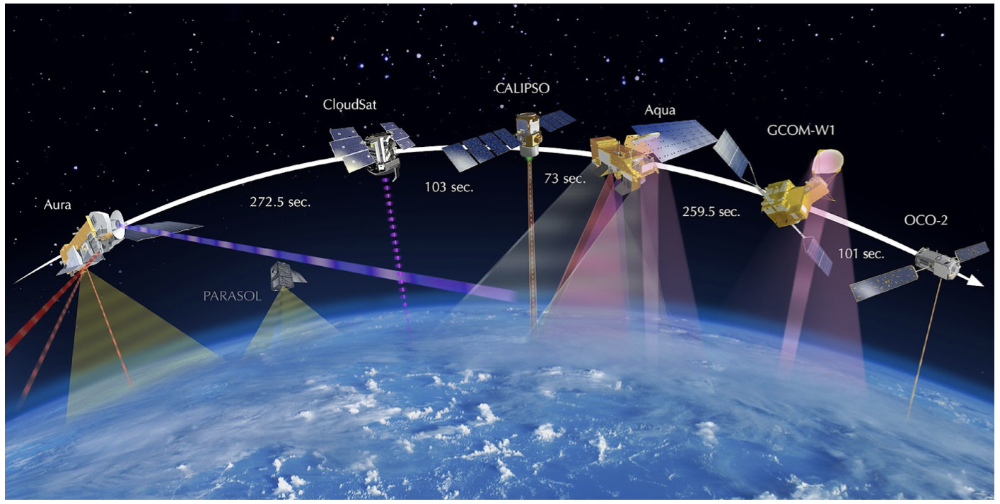

## [<< back](./index.html)

# Hands-on assignments

The hands-on assignments include programming exercises in Python and [Ray](https://ray.io), a distributed data processing framework.

### Assignments 1 & 2

In the first two assignments you will implement a Python library of relational operators (Select, Join, Group-by, etc.) with support for transparent provenance tracking. Your library will automatically capture various types of causal relationships to help users understand dependencies between inputs and outputs of a computation. Your last task will be to port the library into Ray and add support for parallelism based on a code skeleton that we will provide. In the end, users of your library should be able to compose and execute arbitrary relational queries and generate output explanations as shown below:

```
output = query.execute()          # Execute query
explanation = output.explain()    # Generate output explanation
explanation.show()                # Print explanation to stdout
```

### Assignment 3

This assignment requires building a simple ML pipeline that provides insights into the predictions of a black-box medical image classifier. A group of researchers from the BU Department of Medicine will provide a CNN model trained on brain MRIs that predicts whether a patient is likely to develop Alzheimer’s Disease (AD) in the future. The goal is to highlight brain regions that contribute positively or negatively to the model prediction and help doctors verify whether these regions are consistent with current clinical knowledge of AD.


### Assignment 4

The last assignment focuses on profiling a distributed data processing application on Ray. This assignment is based on a recent collaboration between BU and NASA. We will provide a real pipeline that pulls satellite images from Google Earth Engine and applies a regression model to detect changes in land cover over large periods of time. Your task will be to instrument the pipeline, collect performance traces, and visualize these traces to help us identify bottlenecks in the execution. For this assignment, you will run experiments in the [Mass Open Cloud](https://massopen.cloud).



### Due dates
The availability and due dates of the 4 assignments are shown below:

| Assignment | Available | Due | Time |
| :------: | :-----: | :---: | 
| 1 | 09/20 | 10/04 | 2 weeks |
| 2 | 10/05 | 10/21 | 2.5 weeks |
| 3 | 10/27 | 11/11 | 2 weeks |
| 4 | 11/15 | 12/09 | 3.5 weeks |

### Software requirements

You will need to have [Python 3.7+](https://www.python.org/downloads/), [Pytest](https://docs.pytest.org/en/stable/), and [Ray](https://docs.ray.io/en/latest/installation.html) installed.

You can develop and execute Ray applications on Linux and macOS, but support for Windows is limited. Even though Ray is a distributed data processing system, you will typically develop and run initial tests on your local machine. This makes development easier and simplifies cluster deployment, as you can run the exact same code in a cluster environment without making any changes.

### Documentation is your friend

To successfully complete the assignments, always make sure to read the relevant documentation:

- [Python](https://docs.python.org/3/tutorial/)
- [Pytest](https://docs.pytest.org/en/stable/#documentation)
- [Ray](https://docs.ray.io/en/latest)
